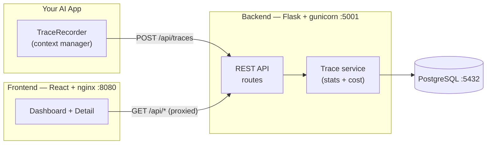

# AgentScope

**Chrome DevTools for AI applications.** AgentScope is an open-source developer tool for observing and debugging LLM-powered apps.


The first feature is the **AI Request Tracer**: every LLM request is captured and stored with its prompts, model, token usage, cost, latency, retrieved documents, tool calls, response and status — then surfaced in a clean, modern dashboard.

---

## Screenshots

### Dashboard

Aggregate metrics and a table of every captured request.


### Trace detail

Click any request to inspect every captured field, including retrieved documents and tool calls.


---

## Features (MVP)

- **Automatic request capture** via a lightweight `TraceRecorder` context manager.
- **REST API** to ingest and query traces.
- **Dashboard** with aggregate metrics: total requests, average latency, average tokens, average cost, success rate.
- **Trace table** with one-click drill-down into a **detail page** showing every captured field.

## Tech Stack

| Layer    | Tech                                   |
| -------- | -------------------------------------- |
| Backend  | Flask, SQLAlchemy, PostgreSQL          |
| Frontend | React (Vite), TailwindCSS, React Router|
| API      | REST (JSON)                            |
| Infra    | Docker, docker-compose, nginx, gunicorn|

## Architecture



The three services run as containers on one Docker network: the React app (nginx) proxies `/api` to the Flask backend, which persists traces to PostgreSQL.

## Project Structure

```
AgentScope/
├── docker-compose.yml           # db + backend + frontend, one command
├── docs/                        # screenshots used in this README
├── backend/
│   ├── app/
│   │   ├── __init__.py          # app factory
│   │   ├── config.py            # env-based config (Postgres / SQLite fallback)
│   │   ├── extensions.py        # SQLAlchemy instance
│   │   ├── models/trace.py      # Trace model
│   │   ├── routes/traces.py     # REST endpoints
│   │   ├── services/trace_service.py   # business logic + stats + cost estimation
│   │   └── middleware/logging.py       # request logging + TraceRecorder
│   ├── Dockerfile               # gunicorn-served API
│   ├── run.py                   # dev entry point
│   ├── seed.py                  # sample data
│   └── requirements.txt
└── frontend/
    ├── Dockerfile               # multi-stage build + nginx
    ├── nginx.conf               # serves SPA, proxies /api -> backend
    └── src/
        ├── pages/Dashboard.jsx
        ├── pages/TraceDetail.jsx
        ├── components/          # StatCard, TracesTable, StatusBadge
        └── api/client.js
```

## Getting Started

### Option A — Run everything with Docker (recommended)

The whole stack (PostgreSQL + Flask backend + React frontend) starts with one command:

```bash
docker compose up -d --build
```

- Frontend: **http://localhost:8080**
- Backend API: **http://localhost:5001/api**
- PostgreSQL: **localhost:5432**

Load sample data (optional, one time):

```bash
docker compose exec backend python seed.py
```

Other handy commands:

```bash
docker compose ps         # status of all 3 services
docker compose logs -f    # tail logs
docker compose down       # stop everything (data persists in the volume)
docker compose down -v    # stop and wipe the database
```

### Option B — Run services manually (for local development)

### 1. Backend

```bash
cd backend
python3 -m venv .venv && source .venv/bin/activate
pip install -r requirements.txt
cp .env.example .env            # set DATABASE_URL (Postgres). Without it, SQLite is used.
python seed.py                  # optional: load 25 sample traces
python run.py                   # http://localhost:5001
```

> The backend listens on **port 5001** by default (macOS uses port 5000 for AirPlay Receiver). Override with the `PORT` env var.
>
> The app defaults to a local SQLite file when `DATABASE_URL` is unset, so you can try it with zero setup. For production, point `DATABASE_URL` at PostgreSQL.

### 2. Frontend

```bash
cd frontend
npm install
npm run dev                     # http://localhost:5173 (proxies /api to :5001)
```

## API

| Method | Endpoint              | Description                  |
| ------ | --------------------- | ---------------------------- |
| POST   | `/api/traces`         | Ingest a new trace           |
| GET    | `/api/traces`         | List traces (most recent)    |
| GET    | `/api/traces/:id`     | Get a single trace           |
| GET    | `/api/stats`          | Aggregate dashboard metrics  |
| GET    | `/api/health`         | Health check                 |

### Capturing a request from your app

```python
from app.middleware.logging import TraceRecorder

with TraceRecorder("gpt-4o", user_prompt=prompt, system_prompt=system) as trace:
    resp = call_your_model(prompt)
    trace.update(
        final_response=resp.text,
        input_tokens=resp.usage.prompt_tokens,
        output_tokens=resp.usage.completion_tokens,
    )
# Latency, status and cost are recorded automatically and persisted.
```

Or POST directly:

```bash
curl -X POST http://localhost:5001/api/traces \
  -H "Content-Type: application/json" \
  -d '{"model_name":"gpt-4o","user_prompt":"Hi","input_tokens":10,"output_tokens":20,"final_response":"Hello!","latency_ms":420}'
```

## Roadmap

`v0.1.0` is the first frozen MVP. Planned next: filtering/search, time-range charts, trace grouping by session, and SDK wrappers for popular providers.

See [CHANGELOG.md](CHANGELOG.md) for release history.

## License

Released under the [MIT License](LICENSE).
