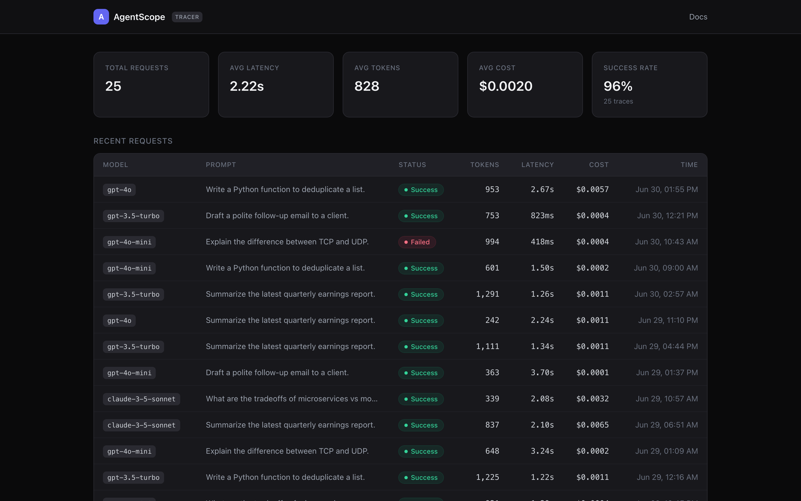
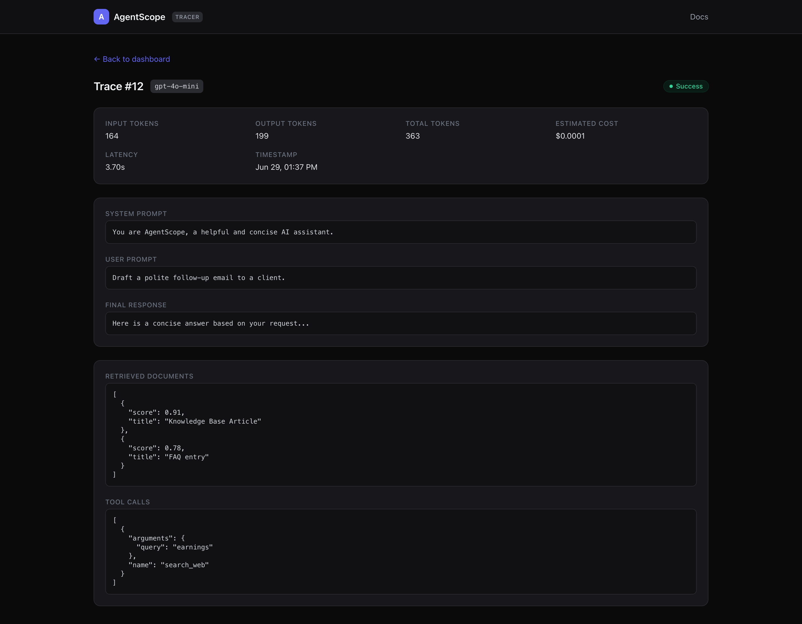
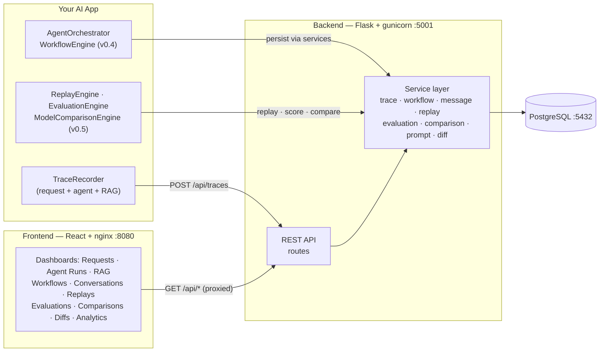
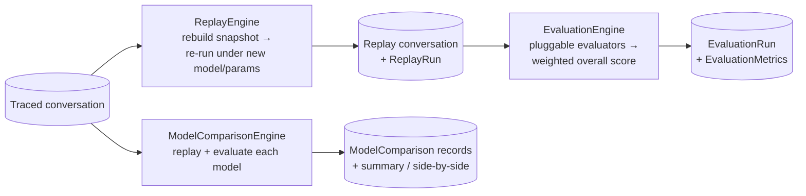

# AgentScope

**Chrome DevTools for AI applications.** AgentScope is an open-source developer tool for observing and debugging LLM-powered apps.


The first feature is the **AI Request Tracer**: every LLM request is captured and stored with its prompts, model, token usage, cost, latency, retrieved documents, tool calls, response and status — then surfaced in a clean, modern dashboard.

AgentScope has since grown five layers of observability, all sharing the same `TraceRecorder` SDK and dashboard:

- **v0.1 — Request tracing.** Per-request prompts, tokens, cost, latency and status.
- **v0.2 — Agent execution tracing.** Full agent-run trees: steps, tool calls, memory accesses and retriever calls, with timelines and an execution tree.
- **v0.3 — RAG Observatory.** Embeddings, vector search, retrieved documents (with similarity scores and selection), reranking and full **prompt assembly** — plus a vendor-neutral `RetrievalService` with adapters for Chroma, FAISS, Pinecone and Qdrant.
- **v0.4 — Multi-agent workflows.** Orchestrate collaborating agents (`AgentOrchestrator`), execute JSON-defined workflows (`WorkflowEngine`) with sequential / parallel / conditional flow, retries, loops, timeouts and cancellation, and trace typed agent-to-agent messages — visualized as an interactive execution graph, agent tree, timeline and chat-like message viewer.
- **v0.5 — Replay, evaluation & comparison.** Re-run any traced conversation under a different model / temperature / prompt / memory / tools (`ReplayEngine`), score it with pluggable evaluators — rule-based, LLM-as-a-Judge or custom (`EvaluationEngine`, 10 built-in metrics) — and run one workflow against many models side by side (`ModelComparisonEngine`). Prompts are auto-versioned so you get **prompt diffs** and full **trace diffs**, all surfaced in Replay, Evaluation, Comparison, Diffs and Analytics dashboards.

---

## Screenshots

### Dashboard

Aggregate metrics and a table of every captured request.



### Trace detail

Click any request to inspect every captured field, including retrieved documents and tool calls.



---

## Features (MVP)

- **Automatic request capture** via a lightweight `TraceRecorder` context manager.
- **REST API** to ingest and query traces.
- **Dashboard** with aggregate metrics: total requests, average latency, average tokens, average cost, success rate.
- **Trace table** with one-click drill-down into a **detail page** showing every captured field.

## Tech Stack

| Layer    | Tech                                   |
| -------- | -------------------------------------- |
| Backend  | Flask, SQLAlchemy, PostgreSQL          |
| Frontend | React (Vite), TailwindCSS, React Router|
| API      | REST (JSON)                            |
| Infra    | Docker, docker-compose, nginx, gunicorn|

## Architecture



The three services run as containers on one Docker network: the React app (nginx) proxies `/api` to the Flask backend, which persists everything to PostgreSQL. The SDK / engine layer (`TraceRecorder`, `AgentOrchestrator`, `WorkflowEngine`, and the v0.5 `ReplayEngine` / `EvaluationEngine` / `ModelComparisonEngine`) stays lightweight — all persistence and business logic live in the service layer, never in routes.

### v0.5 engine flow



## Project Structure

```
AgentScope/
├── docker-compose.yml           # db + backend + frontend, one command
├── docs/                        # screenshots used in this README
├── backend/
│   ├── app/
│   │   ├── __init__.py          # app factory
│   │   ├── config.py            # env-based config (Postgres / SQLite fallback)
│   │   ├── extensions.py        # SQLAlchemy instance
│   │   ├── models/              # trace (v0.1), agent_trace (v0.2), rag_trace (v0.3), workflow_trace (v0.4), evaluation_trace (v0.5)
│   │   ├── routes/              # traces, agent_traces, chat, rag, workflows, evaluations blueprints
│   │   ├── services/            # trace, workflow, message, replay, evaluation, comparison, prompt, diff
│   │   ├── orchestration/       # AgentOrchestrator, WorkflowEngine, ReplayEngine (v0.4–v0.5)
│   │   ├── evaluation/          # EvaluationEngine + pluggable evaluators (v0.5)
│   │   ├── comparison/          # ModelComparisonEngine (v0.5)
│   │   ├── retrieval/           # vendor-neutral RetrievalService + adapters (v0.3)
│   │   ├── serializers/         # reusable ORM→JSON serializers
│   │   ├── utils/               # trace_recorder SDK, pagination, sorting, validation helpers
│   │   └── middleware/logging.py       # request logging
│   ├── scripts/                 # check_pg_v04.py, check_pg_v05.py (PostgreSQL compatibility)
│   ├── Dockerfile               # gunicorn-served API
│   ├── run.py                   # dev entry point
│   ├── seed.py                  # sample data
│   └── requirements.txt
└── frontend/
    ├── Dockerfile               # multi-stage build + nginx
    ├── nginx.conf               # serves SPA, proxies /api -> backend
    └── src/
        ├── pages/               # Dashboard, Agent Runs, RAG, Workflows, Conversations,
        │                        #   Replays, Evaluations, Comparisons, Diffs, Analytics
        ├── components/          # ui/, charts/ (Bar/Line/Radar), eval/ (diff + comparison), …
        └── api/client.js
```

## Getting Started

### Option A — Run everything with Docker (recommended)

The whole stack (PostgreSQL + Flask backend + React frontend) starts with one command:

```bash
docker compose up -d --build
```

- Frontend: **http://localhost:8080**
- Backend API: **http://localhost:5001/api**
- PostgreSQL: **localhost:5432**

Load sample data (optional, one time):

```bash
docker compose exec backend python seed.py
```

Other handy commands:

```bash
docker compose ps         # status of all 3 services
docker compose logs -f    # tail logs
docker compose down       # stop everything (data persists in the volume)
docker compose down -v    # stop and wipe the database
```

### Option B — Run services manually (for local development)

### 1. Backend

```bash
cd backend
python3 -m venv .venv && source .venv/bin/activate
pip install -r requirements.txt
cp .env.example .env            # set DATABASE_URL (Postgres). Without it, SQLite is used.
python seed.py                  # optional: load 25 sample traces
python run.py                   # http://localhost:5001
```

> The backend listens on **port 5001** by default (macOS uses port 5000 for AirPlay Receiver). Override with the `PORT` env var.
>
> The app defaults to a local SQLite file when `DATABASE_URL` is unset, so you can try it with zero setup. For production, point `DATABASE_URL` at PostgreSQL.

### 2. Frontend

```bash
cd frontend
npm install
npm run dev                     # http://localhost:5173 (proxies /api to :5001)
```

## API

**Request tracing (v0.1)**

| Method | Endpoint              | Description                  |
| ------ | --------------------- | ---------------------------- |
| POST   | `/api/traces`         | Ingest a new trace           |
| GET    | `/api/traces`         | List traces (most recent)    |
| GET    | `/api/traces/:id`     | Get a single trace           |
| GET    | `/api/stats`          | Aggregate dashboard metrics  |
| GET    | `/api/health`         | Health check                 |

**Agent execution tracing (v0.2)**

| Method | Endpoint                              | Description                                   |
| ------ | ------------------------------------- | --------------------------------------------- |
| GET    | `/api/agent-runs`                     | List runs (pagination, search, sort, filter)  |
| GET    | `/api/agent-runs/:id`                 | Run detail: steps, tools, memory, timeline    |
| GET    | `/api/requests/:id/agent-runs`        | All runs for a request                        |
| GET    | `/api/dashboard/agent-metrics`        | Aggregate agent-execution metrics             |

**RAG Observatory (v0.3)**

| Method | Endpoint                              | Description                                   |
| ------ | ------------------------------------- | --------------------------------------------- |
| GET    | `/api/retrievals`                     | List retrievals (pagination, search, sort, filter) |
| GET    | `/api/retrievals/:id`                 | Retrieval detail: embedding, docs, scores, prompt, timeline |
| GET    | `/api/prompts/:id`                    | Reconstructed prompt (all sections + final)   |
| GET    | `/api/dashboard/rag-metrics`          | Aggregate RAG metrics                         |

**Multi-agent workflows (v0.4)**

| Method | Endpoint                              | Description                                   |
| ------ | ------------------------------------- | --------------------------------------------- |
| GET    | `/api/workflows`                      | List workflow definitions (pagination, search, sort, filter) |
| GET    | `/api/workflows/:id`                  | Workflow detail: nodes, edges, execution history |
| GET    | `/api/conversations`                  | List conversation runs (pagination, search, sort, status filter) |
| GET    | `/api/conversations/:id`              | Conversation detail: agent tree, messages, timeline, steps |
| GET    | `/api/messages`                       | List messages (filter by sender, receiver, conversation, search) |
| GET    | `/api/dashboard/workflow-metrics`     | Aggregate multi-agent metrics                 |

**Replay, evaluation & comparison (v0.5)**

| Method | Endpoint                              | Description                                   |
| ------ | ------------------------------------- | --------------------------------------------- |
| GET    | `/api/replays`                        | List replay runs (pagination, search, sort, filter) |
| POST   | `/api/replays`                        | Replay a conversation under new model/params  |
| GET    | `/api/replays/:id`                    | Replay run detail                             |
| GET    | `/api/evaluations`                    | List evaluation runs (pagination, search, sort, filter) |
| POST   | `/api/evaluations`                    | Run an evaluation over a conversation         |
| GET    | `/api/evaluations/:id`                | Evaluation run detail (with metrics)          |
| GET    | `/api/comparisons`                    | List model comparisons (pagination, search, sort) |
| POST   | `/api/comparisons`                    | Compare a conversation across multiple models |
| GET    | `/api/prompt-versions`                | List auto-captured prompt versions (filter by `agent_run_id`) |
| GET    | `/api/prompt-versions/:id`            | Single prompt version                         |
| GET    | `/api/prompt-diff?a=&b=`              | Word-level diff of two prompt versions        |
| GET    | `/api/trace-diff?a=&b=`               | Diff two traced conversations (steps/tools/memory/retriever/latency/cost/tokens) |
| GET    | `/api/dashboard/evaluation-metrics`   | Aggregate evaluation metrics                  |
| GET    | `/api/dashboard/evaluation-analytics` | Daily time-series analytics + headline rates  |

All collection endpoints share a `{ "data": [...], "pagination": {...} }` envelope, and errors share a `{ "error": ..., "details": {...} }` envelope.

### Capturing a request from your app

```python
from app.middleware.logging import TraceRecorder

with TraceRecorder("gpt-4o", user_prompt=prompt, system_prompt=system) as trace:
    resp = call_your_model(prompt)
    trace.update(
        final_response=resp.text,
        input_tokens=resp.usage.prompt_tokens,
        output_tokens=resp.usage.completion_tokens,
    )
# Latency, status and cost are recorded automatically and persisted.
```

Or POST directly:

```bash
curl -X POST http://localhost:5001/api/traces \
  -H "Content-Type: application/json" \
  -d '{"model_name":"gpt-4o","user_prompt":"Hi","input_tokens":10,"output_tokens":20,"final_response":"Hello!","latency_ms":420}'
```

### Orchestrating multiple agents (v0.4)

The Multi-Agent SDK coordinates collaborating agents; the conversation, agent
tree and every typed message are traced automatically.

```python
from app.orchestration import AgentOrchestrator

orchestrator = AgentOrchestrator(conversation_name="research")
planner = orchestrator.create_agent(name="Planner", role="planner")
researcher = orchestrator.create_agent(name="Researcher", role="researcher", parent=planner)

planner.ask(researcher, "Research LangSmith.")   # typed, traced message
planner.execute()
researcher.execute()
orchestrator.finish()                             # latency + status persisted
```

### Running a workflow

`WorkflowEngine` executes a JSON-defined graph with automatic tracing. Handlers
supply business logic; they read/write the shared `context` to pass data between
nodes.

```python
from app.orchestration import WorkflowEngine

engine = WorkflowEngine(handlers={"planner": my_planner, "reviewer": my_reviewer})
result = engine.run(spec, context={"question": "..."}, timeout_ms=30_000)
print(result.status, result.visited, result.outputs)
```

#### Workflow JSON format

Definitions are stored in the database and describe a graph of nodes:

```json
{
  "name": "research-flow",
  "version": "1.0",
  "entry": "planner",
  "nodes": {
    "planner":   {"type": "task", "role": "planner", "next": "fanout"},
    "fanout":    {"type": "parallel",
                  "branches": ["research_a", "research_b"],
                  "next": "merge"},
    "research_a": {"type": "task", "role": "researcher", "retries": 2},
    "research_b": {"type": "task", "role": "researcher"},
    "merge":     {"type": "task", "role": "merger", "next": "review"},
    "review":    {"type": "condition",
                  "when": {"var": "confidence", "op": "lt", "value": 0.7},
                  "if_true": "critic", "if_false": "finish"},
    "critic":    {"type": "task", "role": "critic", "next": "review", "max_visits": 3},
    "finish":    {"type": "end"}
  }
}
```

| Node type   | Purpose |
| ----------- | ------- |
| `task`      | Run a handler, traced as one agent. Supports `retries`, per-node `timeout_ms`; `next` names the following node. |
| `parallel`  | Run `branches` (each a task node) concurrently, then continue at `next`. |
| `condition` | Branch to `if_true` / `if_false` via a structured `when` comparison (ops: `eq`, `ne`, `lt`, `lte`, `gt`, `gte`, `in`, `contains`) or a `predicate` handler. Targets may point backwards to form loops, bounded by `max_visits`. |
| `end`       | Terminal node. |

The engine also supports overall `timeout_ms`, cooperative `CancellationToken`, and loop/step guards (`max_visits`, `max_steps`).

### Replaying a conversation (v0.5)

`ReplayEngine` re-runs any traced conversation, faithfully reusing its workflow,
agent sequence, prompts, memory, retrieved documents and tool calls — while
letting you override the model, temperature, `top_p`, system prompt, memory or
tools. Every replay produces a brand-new (fully traced) conversation plus a
`ReplayRun` linked back to the original.

```python
from app.orchestration import ReplayEngine

engine = ReplayEngine()
result = engine.replay(
    conversation_run_id,
    model="gpt-4o-mini",          # re-estimates cost for the new model
    temperature=0.2,
    system_prompt="Be concise.",  # optional overrides
)
print(result.replay_conversation_run_id, result.totals)

# Compare the original against the replay (records a ModelComparison):
comparison = engine.compare(conversation_run_id, result, model_a="gpt-4o", model_b="gpt-4o-mini")
```

Replays run in **mock** mode by default (original outputs / tool results are
replayed as-is; cost is re-estimated for the new model). Pass `live=True` with
`agent_handlers` / `tool_handlers` (role/name → callable) to actually invoke
fresh logic. Over REST:

```bash
curl -X POST http://localhost:5001/api/replays \
  -H "Content-Type: application/json" \
  -d '{"conversation_run_id": 1, "model": "gpt-4o-mini", "temperature": 0.2}'
```

### Evaluating a conversation (v0.5)

`EvaluationEngine` scores a conversation with pluggable evaluators and persists
an `EvaluationRun` with one `EvaluationMetric` per evaluator and a weighted
overall score. Ten rule-based evaluators ship built-in:

| Metric | What it measures |
| ------ | ---------------- |
| `correctness`        | Token-overlap F1 between the answer and a supplied reference. |
| `groundedness`       | Fraction of the answer supported by the retrieved context. |
| `faithfulness`       | Answer support by context **or** question (1 − hallucination). |
| `context_precision`  | Fraction of retrieved documents that were selected/used. |
| `context_recall`     | Fraction of expected facts present in the retrieved context. |
| `answer_relevance`   | Fraction of the question's terms addressed by the answer. |
| `tool_success`       | Fraction of tool executions that succeeded. |
| `memory_usage`       | Fraction of memory accesses whose result was used. |
| `latency_score`      | `max(0, 1 − latency / budget)`. |
| `cost_score`         | `max(0, 1 − cost / budget)`. |

Each returns a `None` value (with a note) when not applicable, so every metric
is always persisted. The overall score is the weighted average of the non-null
values; per-metric `weights` can be overridden per run.

```python
from app.evaluation import EvaluationEngine, CustomEvaluator

# Rule-based (default), plus a custom evaluator and an LLM-as-a-Judge.
engine = EvaluationEngine(judge=lambda prompt: {"score": 0.8, "notes": "ok"})
engine.register(CustomEvaluator("brand_safety", lambda ctx: 1.0, weight=2.0))

result = engine.evaluate(conversation_run_id, reference="…", cost_budget=1.0)
print(result.overall_score, result.score("correctness"))

future = engine.evaluate_async(conversation_run_id)   # runs on a worker thread
```

The **LLM-as-a-Judge** evaluator takes any caller-supplied `judge(prompt)`
callable (returning a float or `{"score", "notes"}`), so there is no hard
dependency on any provider. Over REST (built-in rule-based set):

```bash
curl -X POST http://localhost:5001/api/evaluations \
  -H "Content-Type: application/json" \
  -d '{"conversation_run_id": 1, "reference": "Paris", "cost_budget": 1.0}'
```

### Comparing models (v0.5)

`ModelComparisonEngine` runs one traced workflow against many models — by
replaying the base conversation under each model and (optionally) evaluating it —
then stores pairwise `ModelComparison` records and produces a ranking summary
and a side-by-side matrix (output, latency, tokens, cost, evaluation score, tool
success, memory usage, retriever performance). Model names are opaque strings,
so the design is fully provider-agnostic.

```python
from app.comparison import ModelComparisonEngine

result = ModelComparisonEngine().compare(
    conversation_run_id,
    ["gpt-4o", "gpt-4o-mini", "claude-3-5-sonnet", "gemini-2.5", "llama-3"],
    evaluate=True, reference="…", cost_budget=1.0,
)
print(result.winner, result.summary["best_by"])   # e.g. cheapest / fastest / best-scored
```

```bash
curl -X POST http://localhost:5001/api/comparisons \
  -H "Content-Type: application/json" \
  -d '{"conversation_run_id": 1, "models": ["gpt-4o", "gpt-4o-mini"], "evaluate": true}'
```

### Prompt & trace diffs (v0.5)

Every assembled prompt is **auto-versioned** (hashed, de-duplicated) as a
`PromptVersion`. Compare any two versions for a word-level diff (added / removed
/ modified), or diff two whole conversations on their step / tool / memory /
retriever counts and latency / cost / token totals — with a per-node output
diff. Both power the side-by-side **Diffs** dashboard.

```bash
curl "http://localhost:5001/api/prompt-diff?a=12&b=8"    # word-level prompt diff
curl "http://localhost:5001/api/trace-diff?a=1&b=2"      # full trace diff
```

## Roadmap

- `v0.1.0` — AI Request Tracer (frozen MVP).
- `v0.2.0` — Agent execution tracing (runs, steps, tools, memory, retrievers) + dashboard.
- `v0.3.0` — RAG Observatory: embeddings, retrieval, prompt assembly + vendor-neutral `RetrievalService`.
- `v0.4.0` — Multi-agent workflows: `AgentOrchestrator`, `WorkflowEngine`, agent communication layer, and the Workflows / Conversations dashboards with an interactive execution graph.
- `v0.5.0` — Replay, evaluation & comparison: `ReplayEngine`, `EvaluationEngine` (10 metrics + LLM-as-a-Judge + custom), `ModelComparisonEngine`, auto prompt-versioning with prompt & trace diffs, and the Replays / Evaluations / Comparisons / Diffs / Analytics dashboards.

Planned next: live streaming of traces, session grouping, and first-class SDK wrappers for popular providers.

See [CHANGELOG.md](CHANGELOG.md) for release history.

## License

Released under the [MIT License](LICENSE).
