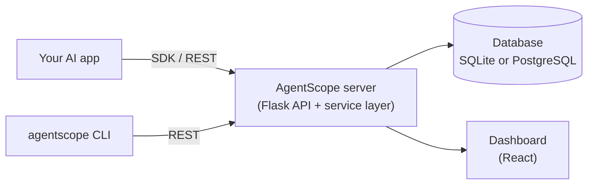

# Getting Started

AgentScope is an observability platform for AI applications. Where a web app has
request logs and a profiler, an AI app has prompts, tokens, costs, tool calls,
retrieved documents, agent hand-offs and non-deterministic model output.
AgentScope captures all of it and gives you a dashboard, a REST API, a Python
SDK and a CLI to inspect, replay and evaluate what your app actually did.

## What problem it solves

LLM applications are hard to debug because the interesting behavior is hidden:

- **Why did it cost that much?** — token usage and per-model cost per request.
- **Why was it slow?** — latency for every step, tool, retrieval and the whole run.
- **Why did it answer that?** — the fully assembled prompt, retrieved documents
  with similarity scores, memory reads and tool results.
- **Did my change help?** — replay a past conversation under a new model/prompt
  and evaluate both side by side.

## The mental model

- **Traces** are the atomic unit: one LLM request with its prompts, tokens, cost,
  latency, response and status.
- **Agent runs** group the steps, tool calls, memory accesses and retriever calls
  behind a single request — forming a tree for multi-agent work.
- **Conversations & workflows** capture collaborating agents and JSON-defined
  execution graphs.
- **Replays, evaluations & comparisons** let you re-run and score past work.

See [Architecture](reference/architecture.md) for the full diagrams.

## Core concepts

| Concept | Meaning |
| ------- | ------- |
| **Trace** | A single captured LLM request (v0.1). |
| **AgentRun / AgentStep** | An agent invocation and its ordered steps (v0.2). |
| **ToolExecution / MemoryAccess / RetrieverTrace** | Side effects recorded within a run (v0.2–v0.3). |
| **PromptAssembly / PromptVersion** | The reconstructed prompt, auto-versioned (v0.3/v0.5). |
| **ConversationRun / AgentNode / AgentMessage** | Multi-agent collaboration (v0.4). |
| **WorkflowDefinition / WorkflowExecution** | A JSON graph and one of its runs (v0.4). |
| **ReplayRun / EvaluationRun / ModelComparison** | Re-runs and scoring (v0.5). |
| **Provider / Plugin** | Vendor-neutral integrations and extensions (v0.6). |
| **Organization / Project / User / ApiKey** | Multi-tenancy and auth (v1.0). |

## What you can do right now, with real data

You do **not** need to seed sample data. Point the SDK (or a raw `POST /api/traces`)
at a running server and your real requests show up immediately in the dashboard.
Seeding is only a convenience for exploring the UI before you have data.

## Next steps

1. [Install AgentScope](installation.md) — Docker is the fastest path.
2. [Follow the Quick Start](quickstart.md) — capture a trace end to end.
3. Pick a guide: [Tracing](guides/tracing.md), [Workflows](guides/workflows.md),
   [Replay](guides/replay.md), [Evaluation](guides/evaluation.md).
