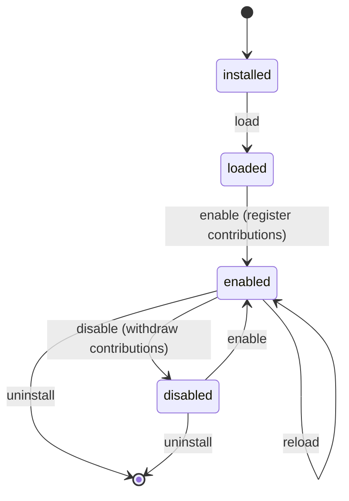

# Plugins

The plugin system lets developers extend AgentScope without modifying core code.
A plugin is any subclass of `PluginBase` that declares `PluginMetadata` — simply
importing its module **auto-registers** it for discovery, so there are no
hardcoded provider or evaluator lists anywhere.

## What a plugin can contribute

| Capability | Constant | Contributes |
| ---------- | -------- | ----------- |
| Custom Tools | `tool` | A callable tool discoverable by name. |
| Custom Evaluators | `evaluator` | An `Evaluator` for the evaluation engine. |
| Custom Memories | `memory` | A memory backend/callable. |
| Custom Retrievers | `retriever` | A retriever / vector store. |
| Custom LLM Providers | `llm_provider` | An LLM provider adapter. |
| Custom UI Extensions | `ui_extension` | A JSON descriptor the dashboard can render. |

## Lifecycle



The `PluginManager` orchestrates `install`, `load`, `enable`, `disable`,
`uninstall` and `reload`. Enable/disable are **cascading**: disabling a plugin
also disables everything that depends on it, and uninstalling cascades the same
way. Contributions registered on enable are withdrawn atomically on disable.

## Metadata, versioning & dependencies

```python
from app.plugins.base import PluginBase, PluginMetadata, Capability, PluginContext

class WeatherToolPlugin(PluginBase):
    metadata = PluginMetadata(
        name="weather-tools",
        version="1.2.0",
        author="Aarohi Sharma",
        description="Adds a weather-lookup tool.",
        capabilities=[Capability.TOOL],
        dependencies=["sample-tools>=1.0"],   # other plugins (version-pinned)
        requires=["requests>=2.0"],            # external Python packages
        tags=["tools", "weather"],
    )

    def register(self, context: PluginContext) -> None:
        context.register_tool("weather", self._lookup, description="Current weather")

    def _lookup(self, city: str) -> dict:
        return {"city": city, "temp_c": 21}

    # Optional lifecycle hooks:
    def on_enable(self):  ...
    def on_disable(self): ...
```

- `dependencies` are other **plugins** by name, optionally version-pinned using
  semantic-version requirements (`>=`, `==`, etc.). The manager verifies them
  before enabling.
- `requires` are external **Python packages** checked against the installed
  environment.
- `capabilities` are validated against the known set; unknown values raise a
  `PluginValidationError`.

## Registering contributions

Inside `register(context)`, call the `register_*` helpers:

```python
context.register_tool(name, tool, **metadata)
context.register_evaluator(name, evaluator, **metadata)
context.register_memory(name, memory, **metadata)
context.register_retriever(name, retriever, **metadata)
context.register_llm_provider(name, provider, **metadata)
context.register_ui_extension(name, descriptor, **metadata)
```

Each contribution is attributed to its owning plugin, so the whole set is
withdrawn cleanly on disable/uninstall.

## Discovery sources

At startup (when `PLUGINS_AUTOLOAD=true`) the loader discovers plugins from:

- **Python packages** listed in `PLUGINS_PACKAGES` (default `app.plugins.builtins`).
- **Filesystem directories** of drop-in `*.py` files in `PLUGINS_DIRECTORIES`.
- **Dotted module paths** in `PLUGINS_MODULES`.
- **pip entry points** in the `PLUGINS_ENTRYPOINT_GROUP` group
  (`agentscope.plugins`) — how third-party pip packages plug in.

## Manage plugins over REST

```bash
curl http://localhost:5001/api/plugins                     # list installed plugins
curl http://localhost:5001/api/plugins/extensions          # list contributed extensions
curl http://localhost:5001/api/plugins/weather-tools       # one plugin's detail
curl -X POST http://localhost:5001/api/plugins/weather-tools/enable
curl -X POST http://localhost:5001/api/plugins/weather-tools/disable
curl -X POST http://localhost:5001/api/plugins/weather-tools/reload
curl -X DELETE http://localhost:5001/api/plugins/weather-tools
```

## From the CLI

```bash
agentscope plugins list
agentscope plugins enable weather-tools
agentscope plugins disable weather-tools
```

## Next

- See the runnable [`examples/07_custom_plugin.py`](../../examples/07_custom_plugin.py).
- Ship a vendor integration as a [Provider](providers.md).
