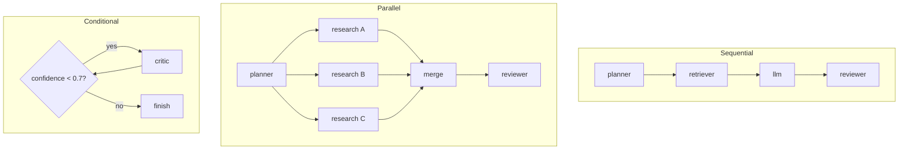

# Workflows

A **workflow** coordinates multiple agents into a single traced execution.
AgentScope provides three complementary tools:

- **`AgentOrchestrator`** — create collaborating agents that message each other.
- **`WorkflowEngine`** — execute a JSON-defined graph (sequential / parallel /
  conditional, with retries, loops, timeouts and cancellation).
- **The agent communication layer** — typed, traced messages between agents.

The SDK also has a lightweight [`Workflow`](../reference/sdk.md#workflow) for
composing steps in your own app. This guide covers the richer server-side engine.

## Orchestrating agents

```python
from app.orchestration import AgentOrchestrator

orchestrator = AgentOrchestrator(conversation_name="research")
planner = orchestrator.create_agent(name="Planner", role="planner")
researcher = orchestrator.create_agent(name="Researcher", role="researcher", parent=planner)

planner.ask(researcher, "Research LangSmith.")   # typed, traced message
planner.execute()
researcher.execute()
orchestrator.finish()                             # latency + status persisted
```

The conversation, agent tree and every message are traced automatically and
visualized as an **execution graph**, **agent tree**, **timeline** and chat-like
**message viewer** in the dashboard.

Message types include instruction, observation, question, answer, critique, tool
result and memory result. Every message records sender, receiver, timestamp,
latency, token usage and metadata.

## Running a workflow graph

`WorkflowEngine` executes a JSON graph. Handlers supply the business logic and
read/write a shared `context` to pass data between nodes.

```python
from app.orchestration import WorkflowEngine

engine = WorkflowEngine(handlers={"planner": my_planner, "reviewer": my_reviewer})
result = engine.run(spec, context={"question": "..."}, timeout_ms=30_000)
print(result.status, result.visited, result.outputs)
```

### Workflow JSON format

Definitions are stored in the database and describe a graph of nodes:

```json
{
  "name": "research-flow",
  "version": "1.0",
  "entry": "planner",
  "nodes": {
    "planner":    {"type": "task", "role": "planner", "next": "fanout"},
    "fanout":     {"type": "parallel",
                   "branches": ["research_a", "research_b"],
                   "next": "merge"},
    "research_a": {"type": "task", "role": "researcher", "retries": 2},
    "research_b": {"type": "task", "role": "researcher"},
    "merge":      {"type": "task", "role": "merger", "next": "review"},
    "review":     {"type": "condition",
                   "when": {"var": "confidence", "op": "lt", "value": 0.7},
                   "if_true": "critic", "if_false": "finish"},
    "critic":     {"type": "task", "role": "critic", "next": "review", "max_visits": 3},
    "finish":     {"type": "end"}
  }
}
```

| Node type   | Purpose |
| ----------- | ------- |
| `task`      | Run a handler, traced as one agent. Supports `retries` and per-node `timeout_ms`; `next` names the following node. |
| `parallel`  | Run `branches` (each a task node) concurrently, then continue at `next`. |
| `condition` | Branch to `if_true` / `if_false` via a structured `when` comparison (`eq`, `ne`, `lt`, `lte`, `gt`, `gte`, `in`, `contains`) or a `predicate` handler. Targets may point backwards to form loops, bounded by `max_visits`. |
| `end`       | Terminal node. |

The engine supports an overall `timeout_ms`, a cooperative `CancellationToken`,
and loop/step guards (`max_visits`, `max_steps`).

### Flow shapes



## API

- `GET /api/workflows` — list workflow definitions.
- `GET /api/workflows/:id` — nodes, edges, execution history.
- `GET /api/conversations` / `GET /api/conversations/:id` — agent tree, messages, timeline.
- `GET /api/messages` — filter by sender, receiver, conversation, search.
- `GET /api/dashboard/workflow-metrics` — aggregate multi-agent metrics.

See [REST API](../reference/rest-api.md) and the runnable
[`examples/06_workflow_engine.py`](../../examples/06_workflow_engine.py).

## Next

- [Replay](replay.md) a captured conversation under a new model.
- [Evaluate](evaluation.md) the quality of a run.
