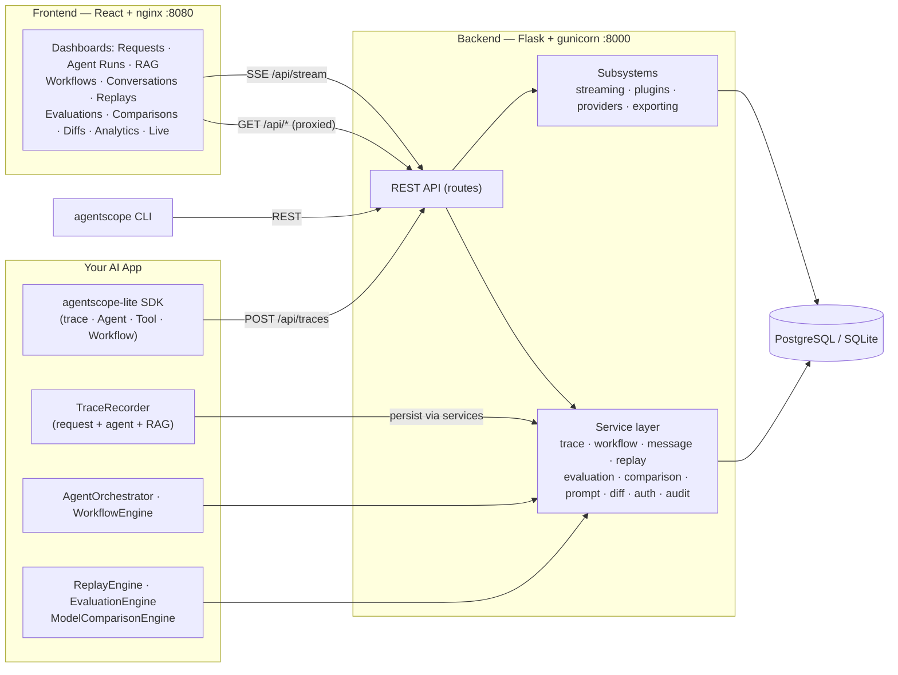
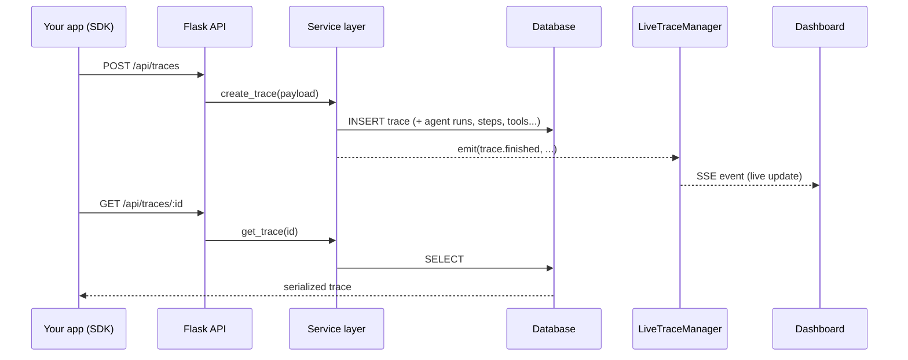
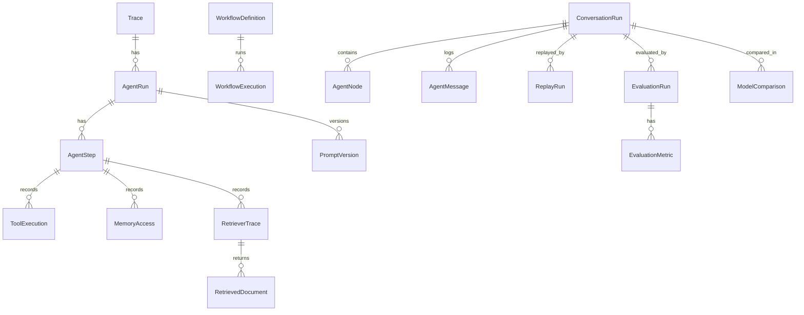
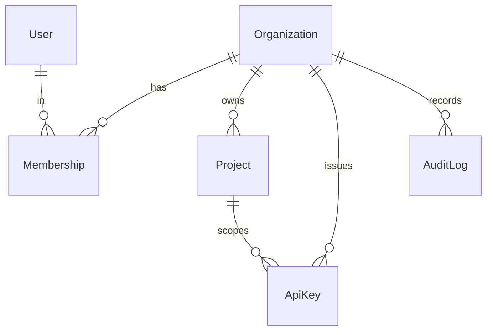
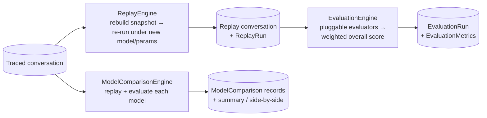
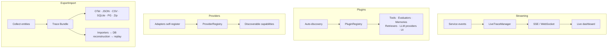

# Architecture

AgentScope is a layered system: a lightweight SDK/engine layer produces traces, a
Flask service layer persists and queries them, a database stores everything, and
a React dashboard (plus REST API and CLI) surfaces it. All diagrams below render
on GitHub via Mermaid.

## System overview



The three services run as containers on one Docker network: the React app
(nginx) proxies `/api` to the Flask backend, which persists to the database. The
SDK/engine layer stays lightweight — all persistence and business logic live in
the service layer, never in routes.

## Request → trace lifecycle



## Data model (high level)



## Multi-tenancy & auth (v1.0)



- `Organization` is the tenant boundary; `Project` is the finest isolation scope.
- A `User` belongs to organizations through a `Membership` carrying a role
  (`admin` / `developer` / `viewer`).
- `ApiKey`s are scoped to an organization (and optionally a project); only their
  SHA-256 hash is stored.
- Authorization funnels through a single `authorize_org` / `authorize_project`
  choke point for consistent isolation and RBAC.

## v0.5 engine flow



## Extension subsystems (v0.6)



## Directory map

```
AgentScope/
├── docker-compose.yml           # db + backend + frontend, one command
├── docs/                        # this documentation
├── examples/                    # runnable example programs
├── backend/
│   └── app/
│       ├── __init__.py          # app factory
│       ├── config.py            # env-based config (Postgres / SQLite fallback)
│       ├── models/              # trace, agent_trace, rag_trace, workflow_trace,
│       │                        #   evaluation_trace, auth
│       ├── routes/              # traces, agent_traces, chat, rag, workflows,
│       │                        #   evaluations, stream, plugins, providers,
│       │                        #   exports, auth, organizations
│       ├── services/            # trace, workflow, message, replay, evaluation,
│       │                        #   comparison, prompt, diff, auth, audit
│       ├── orchestration/       # AgentOrchestrator, WorkflowEngine, ReplayEngine
│       ├── evaluation/          # EvaluationEngine + pluggable evaluators
│       ├── comparison/          # ModelComparisonEngine
│       ├── retrieval/           # vendor-neutral RetrievalService + adapters
│       ├── streaming/           # LiveTraceManager + events (v0.6)
│       ├── plugins/             # PluginManager/Registry/Loader/Base (v0.6)
│       ├── providers/           # provider abstraction + adapters (v0.6)
│       ├── exporting/           # export/import subsystem (v0.6)
│       ├── auth/                # JWT, keys, roles, rate limit, decorators (v1.0)
│       ├── serializers/         # reusable ORM→JSON serializers
│       └── utils/               # trace_recorder SDK, pagination, validation
├── frontend/                    # React (Vite) + Tailwind, nginx-served
└── sdk/                         # agentscope-lite package (SDK + CLI)
```

## Design principles

- **Layered & additive** — each version extends without breaking earlier ones.
- **No business logic in routes** — routes validate and delegate to services.
- **Vendor-neutral** — providers, retrievers and model names are pluggable
  strings; no hard dependency on any vendor.
- **Backward compatible** — SQLite and PostgreSQL both supported; auth is opt-in.
